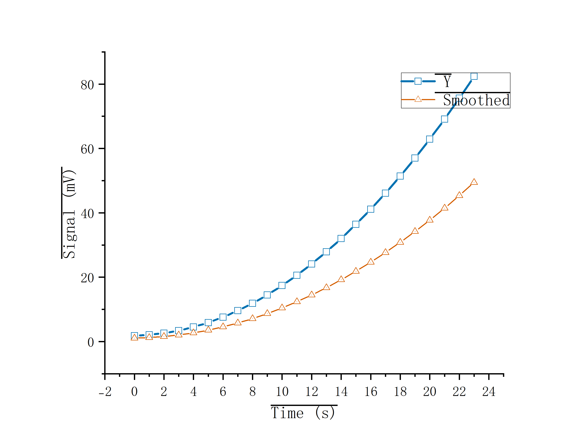

<p align="center">
  
</p>

<h1 align="center">Origin Bridge</h1>

<p align="center">
  用自然语言驱动<b>本机</b> Origin / OriginPro：<br>
  丢给它一个 <code>.dat</code> / <code>.csv</code> / Excel / 电化学工作站 <code>.bin</code>，<br>
  拿回一张发表级图片和一个<b>能在 Origin 里继续编辑</b>的 <code>.opju</code> 工程。
</p>

<p align="center">
  <a href="#安装"></a>
  
  
</p>

<p align="center">
  
</p>

> 上图由 `scripts/make_preview.py` 生成：导入 → 画两条曲线 → 配色与符号 → 关掉图例 → 导出 PNG，全部走本插件自己的引擎调用，轴标题与图例可见性都读回校验后才导出。数据是 `sample.dat` 的合成序列，不含任何真实实验数据。

---

## 为什么是它

市面上把 Origin 接进聊天的尝试，要么要求把数据上传到云端，要么是个 200 行的玩具。Origin Bridge 反着来：

- **数据不出本机。** 没有 API key、没有云端组件，dsh 拉起一个本地 Python 进程，通过 OriginLab 官方的 [`originpro`](https://pypi.org/project/originpro/) 驱动你机器上的 Origin。
- **每一步都有证据。** Origin 的 X-Function 普遍"返回成功但什么都没发生"。这里画图后读回轴范围与数据跨度比对，导出后校验文件存在/体积/文件头魔数，样式逐项读回——读不回的进 `failed` 列表，不会假装成功。
- **不是 74 个工具，是 27 个。** 每个都有实测用途，工具描述里写着实测限制，模型不会踩坑。
- **不是玩具。** 231–237 项自动化测试（本机带真实工作站 .bin 样本时 237）覆盖协议滥用、边界条件、坏句柄、真实数据文件；originpro 的十几个文档陷阱全部记录在案并绕开。

## 它能做什么

| 你说 | 它做 |
|---|---|
| "把 `D:\data\spectrum.dat` 画成散点连线，X 轴 Time (s)，导出到 `D:\out`" | `origin_figure`：导入 → 画图 → 轴标题 → PNG + .opju |
| "这两个文件画在一张图上，双 Y 轴" | `origin_layer`（右 Y 轴）+ `origin_plot`（往指定层画） |
| "给这条谱图加个图例，放右上角" | `origin_legend`（文字/位置/可见性全部读回） |
| "这组 EIS 数据拟合一下" | `origin_fit`（gauss / lorentz / voigt / expdec1… 预设，参数可固定） |
| "这是 CHI 工作站导出的 cv.bin" | `origin_import` 直接读二进制，电势轴按头部方法参数重建 |
| "这是工作站导出的 txt，前面一大段参数" | `origin_import` 自动跳过参数头，紧贴数据的那行（`Potential/V, Current/A`）当表头，单位拆到列的 Units 里，参数进 `metadata` |
| "做一张 XPS 图" | `origin_chart_render`（40 个科研预设：轴标题/图类型/建议拟合） |
| "热力图显示这个矩阵" | `origin_matrix`（heat_map / cmap / mesh / contline，Origin 自带图模） |

数据源支持：`.dat` `.csv` `.txt` `.tsv`（自动嗅探分隔符、GBK、BOM、多行表头、Fortran 指数、NA/-）、`.xls` `.xlsx`、电化学工作站（CH Instruments 等）导出的 `.txt`（几十行仪器说明自动收进 `metadata`，不会把首行日期当成列名），以及头部为 `80 F2 1B 00` 的电化学工作站二进制 `.bin`。

## 安装

要求：Windows、Origin/OriginPro **2021 或更高**（`originpro` 的硬性下限，实测 2018 不可用）、Python 3.10+。

### 方式 A：用 `dsh plugin` 从 npm 装（推荐）

```bash
dsh plugin --profile desktop add dsh-origin-bridge
```

两个包名指向同一个包，装哪个都行：

```bash
dsh plugin --profile desktop add dsh-origin-bridge          # 正式包
dsh plugin --profile desktop add @caob23/dsh-origin-bridge  # 转发壳，依赖上面那个
```

本包是 bundle 包（`package.json` 的 `dsh.bundle.patch` 指向根目录的 `cordis.patch.yml`），`dsh plugin` 装完会自动把它加进 profile 的 `dsh.profile.bundles`，**重启 dsh 即加载**，不用再手写补丁。`dsh plugin` 转发给 pnpm，所以 pnpm 要在 PATH 上。

**npm 只管分发，不管你的 Python 环境**——Origin 依赖必须自己装进 dsh 实际使用的那个解释器：

```powershell
pip install originpro numpy        # 国内网络慢就加 -i https://pypi.tuna.tsinghua.edu.cn/simple
```

包内补丁的默认取值是 `python`（PATH 上那个）和 `profiles/desktop`。依赖装在 venv 里、或者你用的是别的 profile，就设这两个用户环境变量（设完要重开终端、再彻底重启 dsh）：

```powershell
setx ORIGIN_BRIDGE_PYTHON "C:\path\to\.venv\Scripts\python.exe"
setx ORIGIN_BRIDGE_HOME   "$env:USERPROFILE\.dsh\profiles\web\node_modules\dsh-origin-bridge"
```

装完自检（路径按你的 profile 名改）：

```powershell
Test-Path "$env:USERPROFILE\.dsh\profiles\desktop\node_modules\dsh-origin-bridge\server.py"
```

彻底退出 dsh 再打开，新会话里说"列出 origin 开头的工具"，应看到 27 个 `mcp__origin_bridge__origin_*`。卸载：

```bash
dsh plugin --profile desktop remove dsh-origin-bridge
```

> `failOnStartupError: false` 是刻意的：Origin 没开或有模态框卡住 COM 时，只让工具这一轮不注册，不把 dsh 一起拖崩。

### 方式 B：本地 clone（要跑测试或改代码时）

```powershell
cd C:\path\to\dsh-origin-bridge
python -m venv .venv
.\.venv\Scripts\Activate.ps1
pip install -r requirements.txt      # 国内网络慢就加 -i https://pypi.tuna.tsinghua.edu.cn/simple
```

先确认能独立跑通（会自己拉起 Origin）：

```powershell
.\.venv\Scripts\python.exe smoke_test.py     # 97 项，看到 ALL GOOD 才算过
.\.venv\Scripts\python.exe edge_checks.py    # 26 项边界
.\.venv\Scripts\python.exe test_asciiio.py   # 24 项，不需要 Origin
.\.venv\Scripts\python.exe test_binio.py     # 24 项起，不需要 Origin；有真实 .bin 时会跟厂商 .txt 逐点对账
.\.venv\Scripts\python.exe test_lifecycle.py # 20 项，不需要 Origin：实例分类/回收的安全边界
```

### 不是 dsh，是别的 MCP 客户端

npm 装完会生成 `origin-bridge` 这个可执行入口（`bin/origin-bridge.mjs`），stdio 直连，配置里把 `command` 指向它或指向 `node_modules/dsh-origin-bridge/bin/origin-bridge.mjs`，`serverName` 保持 `origin_bridge` 即可，工具名仍是 `mcp__origin_bridge__origin_*`。

## 挂进 dsh（只针对方式 B）

走方式 A 的话这一段可以整个跳过——`dsh plugin` 已经替你写好了。下面是本地 clone 时的两种接法。

自动（推荐，会先备份再写入）：

```powershell
powershell -ExecutionPolicy Bypass -File .\install_dsh.ps1 -Profile desktop
```

手动：编辑 `C:\Users\<你>\.dsh\profiles\desktop\cordis.patch.yml`（**先备份**），在文件**末尾**追加：

```yaml
- insert:
    - id: mcp-origin-bridge
      name: '@deepseek-ai/dsh-mcp-client'
      config:
        serverName: origin_bridge
        transport: stdio
        command: 'C:\path\to\dsh-origin-bridge\.venv\Scripts\python.exe'
        args: ['-u', '-X', 'utf8', 'C:\path\to\dsh-origin-bridge\server.py']
        env:
          PYTHONIOENCODING: utf-8
          PYTHONUNBUFFERED: '1'
        failOnStartupError: false
        toolCallTimeoutMs: 180000
```

然后**彻底退出 dsh 再打开**（配置只在启动时读一次）。新会话里说"列出 origin 开头的工具"应能看到 27 个 `mcp__origin_bridge__origin_*`。

> 三个必须对的点，都是踩过的坑：
> 1. **必须以 `- insert:` 开头。** 直接写 `- id: 新名字` 是"覆盖下层已存在条目"的语法，对全新 id 会被 dsh **静默忽略**——症状就是改了配置、重启了、什么都没发生。
> 2. `name:` 那行必须是 `@deepseek-ai/dsh-mcp-client`（dsh 的 app 包里自带这个 loader），少了它条目不会被任何加载器接管。
> 3. `serverName` 只能是标识符：工具名是 `mcp__<serverName>__<tool>`，写成 `origin-plot` 这种带连字符的名字会得到没法寻址的工具。
>
> `failOnStartupError: false` 别省：Origin 没装或卡在弹窗时，它保证 dsh 照常启动，只是那一次不注册工具。

不想用 `install_dsh.ps1` 也不用 npm 的话，可以把整个目录拷进 `<DSH_HOME>\profiles\<profile>\node_modules\dsh-origin-bridge\`，仓库自带的 `cordis.patch.yml` 就是 bundle 层补丁——但这只是方式 A 的手动等价物，路径与解释器仍靠 `ORIGIN_BRIDGE_HOME` / `ORIGIN_BRIDGE_PYTHON` 指定，正常情况请直接走方式 A。卡片图标与显示名来自 `icon.svg` 和 `locale/en.json`、`locale/zh.json`。

## 工具（27 个）

| 工具 | 用途 |
|---|---|
| `origin_status` | 连接检查、Origin 版本、已开页面。**动手前先调它** |
| `origin_read_file` | 只解析文件不碰 Origin：编码、分隔符、表头行、每列长名/单位/有效行数；`.bin` 走另一条路线给出技术/点数/方法参数/轴来源 |
| `origin_import` | 导入 `.dat/.csv/.txt/.tsv/.xls/.xlsx/.wks` 和工作站二进制 `.bin`，返回 `ws-N` 句柄和列清单 |
| `origin_write` | 内联数据建表：窄表 `columns={列名:[值…]}`，宽表 `headers`+`rows`（一次写完） |
| `origin_formula` | 给列设计算公式（Fx）做派生列，读回算出的行数与首末值 |
| `origin_plot` | 单条或**多条**曲线；`template` 走 Origin 自带图模；`graph`+`layer` 往指定层画 |
| `origin_layer` | 加层（右 Y 轴、上下多面板），返回 Origin 给这层起的名字作为证据 |
| `origin_legend` | 图例：按列长名自动生成或写死，12 个位置，文字/可见性/坐标都读回 |
| `origin_style` | 轴标题、**对数轴**、范围与步长、逐曲线颜色/线宽/符号形状/大小/填充/透明度，**每项读回验证** |
| `origin_annotate` | 图上文字标注与参考线（数据坐标） |
| `origin_matrix` | 网格数据 → 矩阵 → **热力图 / 等高线 / 3D 彩色映射面**（模板驱动） |
| `origin_fit` | `linear`（标准版可用）；预设 `gauss/lorentz/voigt/expdec1/expdec2/sine/power/logistic/boltzmann/doseresp/cubic`；或 `nlfitsing`+`func` |
| `origin_chart_presets` | 40 个科研图表预设（XPS/XRD/UV-Vis/荧光/循环伏安/Arrhenius…） |
| `origin_chart_preset` | 单个预设的完整约定：要哪些列、默认轴标题、建议拟合、轴向提示 |
| `origin_chart_check` | 拿数据列名对预设做 dry-run，不碰 Origin |
| `origin_chart_render` | 按预设一步出图（轴标题/图类型/图例/图片/opju） |
| `origin_export` | 出图，带文件存在/体积/文件头校验，PNG 还回读宽高 |
| `origin_view` | 把图渲染成小图以 **MCP image content 回传给模型自己看** |
| `origin_save_project` | 存 `.opju`（可编辑工程，不是截图） |
| `origin_open` | 打开已有工程 |
| `origin_inspect` | 读回页面/图层/曲线数与已分配句柄——**改图前先看它，别猜索引** |
| `origin_close_pages` | 清理攒下来的页面（长会话里这是"无效指针"的根因），支持 dry_run |
| `origin_labtalk` | 逃生舱：原始 LabTalk + 强制读回 |
| `origin_exit` | 关 Origin，可选先存盘 |
| `origin_instances` | 清点机器上的 Origin 实例：后台无窗口（客户端退出后的残留）vs 前台有窗口（可能是用户自己的项目），并标出哪些是本进程起的 |
| `origin_reclaim` | 回收残留实例：**只关没有窗口的**；有窗口的一律不动，只在返回里提示用户自己关。`close_background:false` 只看不动手 |
| `origin_figure` | 主路径：导入→画图→轴标题→图例→图片+opju 一次完成 |

## 工作站 `.bin` 是怎么回事

那种头部以 `80 F2 1B 00` 开头、写着 `Cyclic Voltammetry` / `A.C. Impedance` / `Amperometric i-t Curve` 的文件（CHI660E 一类工作站导出），尾部是**一个** float32 数组 = 测量通道（电流 A），**电势轴不在文件里**。

Origin Bridge 的做法：

1. 从头部"数据起点前 600 字节"的参数块读 Init/High/Low E、步长、段数；
2. 按"正向起步的三角波"重建电势轴，**重建点数必须与文件点数完全相等**才采信，否则退回 `axis=none` 并说明原因，绝不拿错的 X 轴画图；
3. i-t / CA / CP 的时间轴直接由采样间隔展开；EIS 的频率表是另一套参数，明说拿不到，不猜。

这条重建规则对着厂商自己导出的 `.txt` 逐点核过：5 个文件、每个 600 点，电势和电流 **0 处不符**。

## 设计取舍

**为什么不用 `mcp` SDK 的 stdio 传输。** SDK 建的是 asyncio `ProactorEventLoop`，其 self-pipe 在 Windows 上回落到 `socketpair()`（127.0.0.1 listen+connect+accept）。防火墙拦回环 accept 的机器上这一步永久阻塞 → initialize 永不返回 → 客户端等满 60 秒超时。`server.py` 用同步换行分隔 JSON-RPC，握手毫秒级，零事件循环依赖。

**为什么返回句柄而不是 Origin 引用字符串。** `[Book1]Sheet1!` 这类引用对大小写、空格、活动页状态都敏感，写错了不报错只静默失败。引擎内部持有真实对象，把 `ws-1` / `gr-2` 交给模型原样传回。

**为什么进程探测失败要报 `probe: "unavailable"` 而不是空列表。** `origin_instances` / `origin_reclaim` 靠读进程表区分"没人看的后台实例"和"用户正开着的窗口"。如果 powershell 不可用或超时就让它们返回空集合，调用方读到的是"没有残留、没有前台窗口"——一个假的清白结论。宁可说"我没看清、这次什么都没做"，也不能把"未知"报成"没事"。

**为什么连接时不自动回收既存的无窗口实例。** 被 dsh 驱动的那个 Origin **本身就是无窗口的**：可见性只说明"没有人在屏幕前看它"，不说明"没有客户端在用它"。开机时顺手杀掉所有无窗口实例，会直接砍掉用户当前会话正在跑的任务。所以只有显式 `origin_reclaim` 才动手，且只动无窗口的；有窗口的一律留给用户自己关。

**两条画图路径，各自实测过。** 单 x/单 y 走 LabTalk `plotxy`——那是 Origin 工具栏自己的路径，主题、配色、自动缩放都对。多条曲线 / 指定层 / 指定模板走 `layer.add_plot()` + `layer.rescale()`：`add_plot` 不 rescale 就是 0..10 空轴，但 rescale 之后颜色/符号/线宽全部正确，且**只有它能精确投到某一层**——`plotxy` 给限定范围时返回 True 却画到别的页/层上去了。

**为什么每次写入都读回。** `plot()` 读回轴范围和数据跨度比对，不符就报 `plot_axis_degenerate`；`origin_export` 校验文件存在、体积、文件头魔数；`style()` / `legend()` 每项读回，读不进的进 `failed`。

**缺失值消毒。** Origin 用 `-1.23456789e-300` 表示 missing，直接吐给模型会被当成真实拟合参数。`sanitize()` 统一转成 `null`。

## originpro 1.1.15 / OriginPro 2024 实测陷阱（维护者必读）

这几条都是文档和实际行为不一致，靠读 API 文档写会静默出错：

| 陷阱 | 实际行为 | 处置 |
|---|---|---|
| `lay.add_plot(...)` | 返回 Plot 对象、不报错，但轴停在 0..10 的**空图** | 只在 `rescale()` 之后使用，并用轴范围读回反证 |
| `plotxy` 的 `plot:=` 代码 | 200 线、201 散点、202 线+符号、203 柱（**不是**常见的 201=line） | `PLOT_CODES` 常量，逐个导图目视确认 |
| `plotxy` 往指定层画 | 给限定范围返回 True，曲线却不在目标层（甚至多出一层重叠轴） | 指定层一律用 `add_plot` + `rescale` |
| `add_layer(t)` | t=0 BottomXLeftY、1 TopX、**2 RightY**、3 LeftY、4 TopXRightY、5 BottomXRightY、6 Inset | `LAYER_TYPES` 名字表 + 读回 `layer.name` 当证据 |
| `plot.set_cmd("w=2.5")` | 设线宽**静默无效**（`get_float('line.width')` 仍 0.5） | 用 `set_float('line.width', v)` 并读回比对 |
| `legend` X-Function | `legend 1;` 把图例写成 "111"；`legend -s Graph1` 写成 "Graph1Graph1Graph1"；`legend -p br` 不挪图例反而多出写着 "br" 的文本框 | `legend -r;` 自动生成，文字走 `layer.label('Legend').text`，位置写 `Legend.x/Legend.y`（该层**数据坐标**，锚点是图例中心） |
| `obj.is_open` | 含义是"没被最小化/隐藏"，**不是**"页面还存在" | `close_pages` 用关闭后重新枚举页面名单作为证据 |
| `op.pages()` | 是**生成器**：迭代第二次静默返回空 | 一律 `list(...)` 落地 |
| `WSheet.set_formula(col, …)` | 文档写 1-offset，实际 **0-based**；传 `idx+1` 在 `SetStrProp` 上抛 NoneType | 传 0-based `idx`，列不够先扩列 |
| `WSheet.from_list2(data)` | 内层列表是**列**不是行 | `write_block` 内部转置 |
| `Axis.scale` / `lay.xscale` | setter 收 `'log10'`，getter 返回**整数** 2 | `SCALE_TYPES` 映射后按整数比对 |
| `lt_exec('layer.x.title$="…"')` | 返回 **False**；字符串赋值类 LabTalk 走不通 | 轴标题走对象模型 `origin_style` |
| `op.NLFit(name)` | **区分大小写**且无别名：`Gauss` 可用，`gauss1`/`Linear`/`Quadratic`/`FRADA` 直接抛 Invalid fitting function | `FIT_PRESETS` 只收逐个构造成功的名字 |
| `op.path('p')` | 返回工程**所在文件夹**，不是工程文件 | 自己用 `_project_file` 记录绑定 |
| `op.save(file)` | 语义是 Save-As；绑定后再存同名返回 False（不是失败） | 同路径改用无参 `op.save()`，并比对 mtime |
| COM 线程亲和 | 连接必须在**专用 COM 线程**上建立；在 stdio 读线程上连接会跨 apartment 复用对象 | `_resolve()` 只查句柄表不碰 COM；有"图工具作为首个调用"的回归项守着 |
| 已销毁对象的 `.name` | 留下 C 层待处理异常，之后一个不相干的 `len()` 才炸成 `SystemError` | 句柄登记时顺手存页面名，清理句柄表不再回摸 COM |
| 桥坏到一定程度 | `op.path()` 抛 "returned a result with an exception set"，此时连 `op.exit()` 都跑不动；自动 `detach()/attach()` 会把可诊断的报错变成**进程直接崩** | 不自愈，抛 `connection_error` 并写明要外部重启 Origin |
| 工作站 `.bin` 的数组布局 | 看着像两列（各 N/2），其实厂商 `.txt` 里那 600 行电流正好等于整个数组——只有测量通道 | `binio.py` 按单通道 + 方法参数重建轴，点数相等做门禁 |

## 已知边界

- `originpro` 要求 Origin **2021+**。实测 OriginPro 2018C：能连、能存空工程，但导入返回 0 行、`add_plot` 直接打死连接器。
- 非线性拟合需要 **OriginPro** 授权；标准版调 `origin_fit(kind='gauss')` 会明确报 `fit_function_unavailable`。
- `.bin` 只覆盖 `80 F2 1B 00` 头的工作站导出；**EIS 的频率表在另一套参数里，所以 `.bin` 的 EIS 只有测量列**。Gamry / Autolab / Pine 等其它厂商二进制没做，也不猜。
- 图例位置是"按数据坐标摆放"，对数轴上分数位置会偏；没有"避让数据点"的智能摆放。
- 中文/网盘路径导出历史上不稳，导出建议 ASCII 本地路径。
- Origin 以管理员运行而 Python 不是（或反之）时 COM 连不上，两侧权限要一致。
- 长会话攒太多页面会让 COM 桥报"无效指针"。`origin_close_pages` 能清，根治是 `origin_exit` 后重连。
- **Origin 实例不会跟着客户端退出**：originpro 需要时自己拉一个 Origin，Python 进程结束那个实例还在。攒够就会报"实例超过上限"。现在插件在进程退出时回收**自己起的、且没有窗口的**实例（`atexit`），历史残留用 `origin_reclaim` 清；有窗口的实例永远不动，因为那可能是你正开着的项目。
- 统计批处理（t 检验 / ANOVA / PCA / 生存分析）没有，originpro 本身也不提供。
- **无并发保护**：两个会话同时驱动 Origin 会互相踩。
- 40 个图表预设只取元数据；预设自带的 `render_template()` 会先 `op.new()`——那会把用户正在编辑的工程整个丢掉，所以这里换成自己的渲染路径。

## 排障

| 现象 | 先查 |
|---|---|
| dsh 里看不到工具 | 配置是不是漏了 `- insert:`；`name:` 有没有写成 `@deepseek-ai/dsh-mcp-client`；有没有彻底退出重启 dsh；`python server.py --tools` 能否列出 27 个 |
| `connection_error` | Origin 是否 ≥2021；`pip show originpro`；任务管理器里 `Origin64.exe` 是否只有一个 |
| 报"实例超过上限" | `origin_instances` 看有几个、哪些没窗口；`origin_reclaim` 关残留的后台实例；有窗口的那些要用户自己关（可能有未保存的东西） |
| `import_empty` | 先 `origin_read_file` 看结构；空格/多行表头已由自研解析器处理，走到这个报错说明文件本身没有数值行 |
| `com_timeout` | Origin 窗口是否卡在对话框/许可证弹窗 |
| `无效指针` | 页面攒太多：`origin_close_pages`，或 `origin_exit` 让它重开 |
| 图片没出来 | `origin_inspect` 看 `plots` 是否为 0；换 ASCII 路径 |
| 图是空的但没报错 | 看返回里的 `proof_level`；`plot_axis_degenerate` 会主动抛出 |

## 给维护者

```
dsh-origin-bridge/
├── server.py            # 同步 stdio JSON-RPC，27 个工具的分发与 schema
├── originlab.py         # 引擎：COM 专用线程、句柄表、每个操作及其读回验证
├── asciiio.py           # 健壮的 ASCII 读取（分隔符嗅探 / GBK / 多行表头）
├── binio.py             # 工作站 .bin：单测量通道 + 方法参数重建电势轴
├── templates_catalog.py # 40 个科研图表预设（纯元数据）
├── cordis.patch.yml     # dsh bundle 补丁（serverName: origin_bridge）
├── install_dsh.ps1      # 一键装入 dsh（备份 + 写 profile 层 + 自检）
├── icon.svg             # 卡片图标（scripts/make_icon.py 生成）
├── locale/*.json        # dsh 卡片显示名与描述
├── scripts/make_preview.py # 重新生成 docs/preview.png（关掉图例后才导出）
└── test_*.py / smoke_test.py / edge_checks.py   # 231–237 项测试
```

重新生成图标：`python scripts/make_icon.py`（只需要 numpy，PNG 由 stdlib 手写）。

## 商标声明与许可

本项目是独立的第三方工具，与 OriginLab Corporation **无关联、无合作、未获认可**。Origin、OriginPro 为 OriginLab Corporation 的商标；本工具通过 OriginLab 官方公开发布的 `originpro` Python 包以正常方式使用其产品，未分发其任何二进制、图标或文档。

MIT © Origin Bridge Contributors
